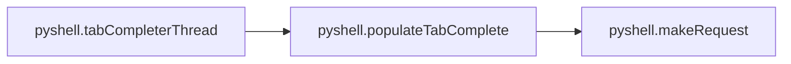
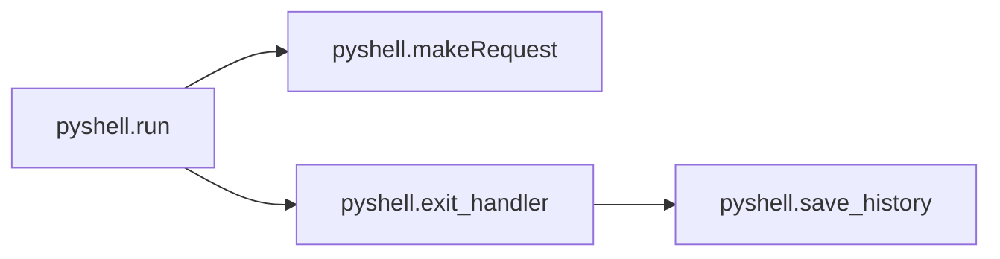
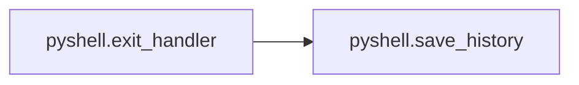

# Key Objects

[_Documentation generated by Documatic_](https://www.documatic.com)

<!---Documatic-section-pyshell.complete-start--->
## pyshell.complete

<!---Documatic-section-complete-start--->


### Object Calls

* pyshell.populateTabComplete

<!---Documatic-block-pyshell.complete-start--->
<details>
	<summary><code>pyshell.complete</code> code snippet</summary>

```python
def complete(text, state):
    tokens = readline.get_line_buffer().split()
    thistoken = tokens[-1]
    thisdir = os.path.dirname(thistoken)
    thispath = os.path.abspath(os.path.join(current_path, thisdir))
    if thispath != '/':
        thispath += '/'
    if thispath not in tab_complete:
        populateTabComplete(thispath)
    if thispath not in tab_complete:
        return False
    suffix = [x for x in tab_complete[thispath] if x.startswith(text)][state:]
    if len(suffix):
        result = suffix[0]
        if result[-1] != '/':
            result += ' '
        return result
    return False
```
</details>
<!---Documatic-block-pyshell.complete-end--->
<!---Documatic-section-complete-end--->

# #
<!---Documatic-section-pyshell.complete-end--->

<!---Documatic-section-pyshell.populateTabComplete-start--->
## pyshell.populateTabComplete

<!---Documatic-section-populateTabComplete-start--->


### Object Calls

* pyshell.makeRequest

<!---Documatic-block-pyshell.populateTabComplete-start--->
<details>
	<summary><code>pyshell.populateTabComplete</code> code snippet</summary>

```python
def populateTabComplete(path):
    global tab_complete
    entries = makeRequest(20, 'bash', '-c "cd {} && ls -p"'.format(path)).split('\n')[:-1]
    if entries:
        tab_complete[path] = entries
```
</details>
<!---Documatic-block-pyshell.populateTabComplete-end--->
<!---Documatic-section-populateTabComplete-end--->

# #
<!---Documatic-section-pyshell.populateTabComplete-end--->

<!---Documatic-section-pyshell.tabCompleterThread-start--->
## pyshell.tabCompleterThread

<!---Documatic-section-tabCompleterThread-start--->


### Object Calls

* pyshell.populateTabComplete

<!---Documatic-block-pyshell.tabCompleterThread-start--->
<details>
	<summary><code>pyshell.tabCompleterThread</code> code snippet</summary>

```python
def tabCompleterThread():
    while True:
        path = q.get()
        if path == '>>exit<<':
            break
        populateTabComplete(path)
```
</details>
<!---Documatic-block-pyshell.tabCompleterThread-end--->
<!---Documatic-section-tabCompleterThread-end--->

# #
<!---Documatic-section-pyshell.tabCompleterThread-end--->

<!---Documatic-section-pyshell.run-start--->
## pyshell.run

<!---Documatic-section-run-start--->


### Object Calls

* pyshell.makeRequest
* pyshell.exit_handler

<!---Documatic-block-pyshell.run-start--->
<details>
	<summary><code>pyshell.run</code> code snippet</summary>

```python
def run():
    global timeout
    global url
    global current_path
    q.put('/')
    while True:
        try:
            inputstr = input('{}{} {}${} '.format(bcolors.OKBLUE, current_path, bcolors.WARNING, bcolors.ENDC))
        except EOFError:
            exit_handler()
            break
        parts = inputstr.split(' ', 1)
        if len(parts) == 1:
            parts.append(' ')
        if parts[0] == 'exit':
            q.put('>>exit<<')
            break
        if parts[0] == 'cd':
            if parts[1] == ' ':
                current_path = '/'
            else:
                current_path = os.path.abspath(os.path.join(current_path, parts[1])).strip()
            q.put(current_path)
            continue
        if parts[0] == 'get':
            path_to_download = os.path.abspath(os.path.join(current_path, parts[1])).strip()
            tgz = makeRequest(timeout, 'tar', 'cz {}'.format(path_to_download), noDecode=True)
            filename = path_to_download.replace('/', '_') + '.' + strftime('%Y%m%d%H%M%S') + '.tgz'
            if not os.path.exists(downloads_directory):
                os.makedirs(downloads_directory)
            f = open(os.path.join(downloads_directory, filename), 'wb')
            f.write(tgz)
            f.close()
            print('Saved as {}'.format(filename))
            continue
        if parts[0] == 'settimeout':
            timeout = int(parts[1])
            print('Timeout set to {} seconds'.format(timeout))
            continue
        cmd = 'bash'
        opts = '-c "cd {} 2>&1 && {} 2>&1"'.format(current_path, inputstr.replace('"', '\\"'))
        result = makeRequest(timeout, cmd, opts)
        print('{}{}'.format(bcolors.ENDC, result))
```
</details>
<!---Documatic-block-pyshell.run-end--->
<!---Documatic-section-run-end--->

# #
<!---Documatic-section-pyshell.run-end--->

<!---Documatic-section-pyshell.exit_handler-start--->
## pyshell.exit_handler

<!---Documatic-section-exit_handler-start--->


### Object Calls

* pyshell.save_history

<!---Documatic-block-pyshell.exit_handler-start--->
<details>
	<summary><code>pyshell.exit_handler</code> code snippet</summary>

```python
def exit_handler():
    save_history()
    q.put('>>exit<<')
    print(bcolors.ENDC)
```
</details>
<!---Documatic-block-pyshell.exit_handler-end--->
<!---Documatic-section-exit_handler-end--->

# #
<!---Documatic-section-pyshell.exit_handler-end--->

<!---Documatic-section-pyshell.makeRequest-start--->
## pyshell.makeRequest

<!---Documatic-section-makeRequest-start--->
<!---Documatic-block-pyshell.makeRequest-start--->
<details>
	<summary><code>pyshell.makeRequest</code> code snippet</summary>

```python
def makeRequest(timeout, cmd, opts, noDecode=False):
    requestData = urllib.parse.urlencode({'timeout': timeout, 'cmd': base64.b64encode(cmd.encode('ascii')).decode(), 'opts': base64.b64encode(opts.encode('ascii')).decode()}).encode('ascii')
    result = urllib.request.urlopen(url, data=requestData).read()
    if noDecode:
        return result
    return result.decode()
```
</details>
<!---Documatic-block-pyshell.makeRequest-end--->
<!---Documatic-section-makeRequest-end--->

# #
<!---Documatic-section-pyshell.makeRequest-end--->

<!---Documatic-section-pyshell.save_history-start--->
## pyshell.save_history

<!---Documatic-section-save_history-start--->
<!---Documatic-block-pyshell.save_history-start--->
<details>
	<summary><code>pyshell.save_history</code> code snippet</summary>

```python
def save_history(historyPath=historyPath):
    readline.write_history_file(historyPath)
```
</details>
<!---Documatic-block-pyshell.save_history-end--->
<!---Documatic-section-save_history-end--->

# #
<!---Documatic-section-pyshell.save_history-end--->

[_Documentation generated by Documatic_](https://www.documatic.com)